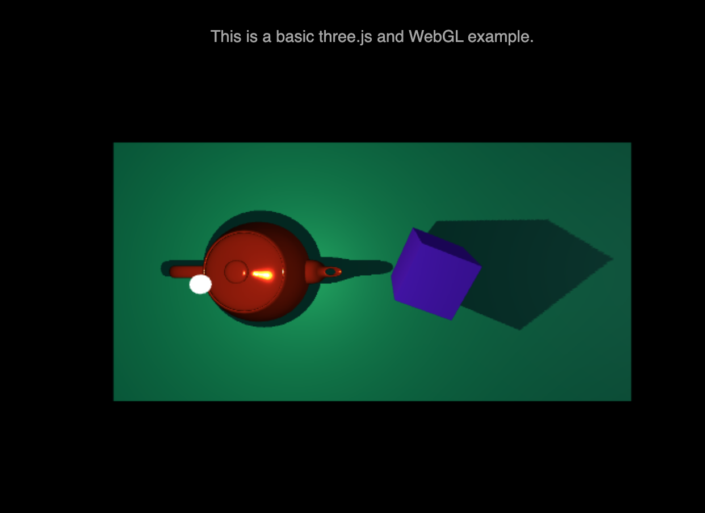
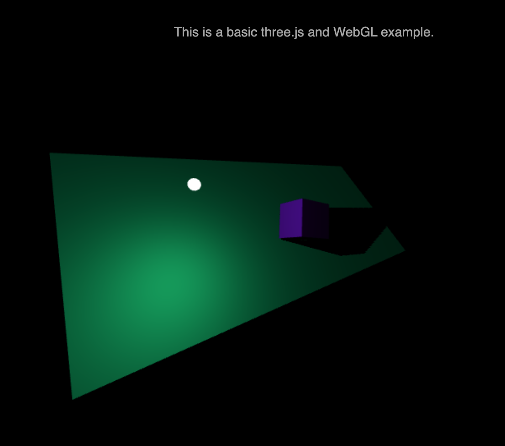
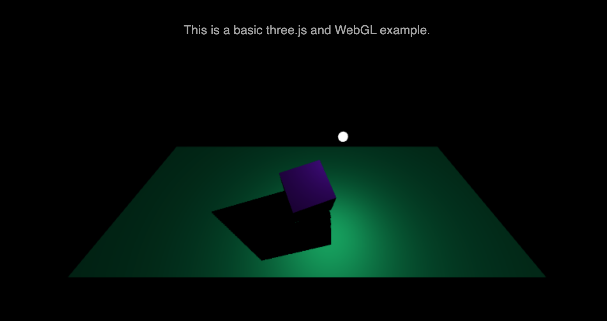

# webGLPlayground
This is my playground repository for webGL and three.js examples.

## Run on Mac
1. Install up-to-date version of threejs: `npm install three`
2. Create and run a local server: e.g. `ruby -run -e httpd . -p 8080`

## Current Features
- Point Light
- Directional Light
- Shadow Casting
- Controlable Scene by mouse

## Current Progress

